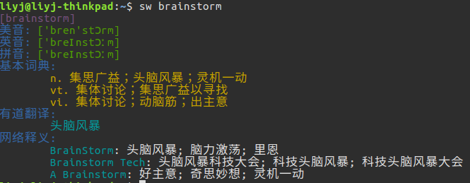

Storm Words
=====================
Introduction
------------
Storm Words is a tool written in Python 3, which can help you remember English words by the way of brainstorm. 

YouDao AICloud API
------------------
- [API URL] : http://openapi.youdao.com/api
- [API doc URL]：http://ai.youdao.com/docs/doc-trans-api.s
- Language support : 中文zh-CHS、日文ja、英文En、韩文ko、法文fr、俄文ru、葡萄牙文pt、西班牙文es



YouDao web
----------
- [Web URL] : http://dict.youdao.com/search?keyfrom=dict.top&q=
- [Translation URL] : http://fanyi.youdao.com/translate?keyfrom=dict.top&i= 

Help
----
```
sw [-n] [-l] [--clear] [-d word] [-s path] [--help] word
[-n] query words do not use database 
[-a] use YouDao AICloud API
[-l] list all the words in database
[-c] clear the database
[-d word] delete a word from database
[--help] show help
```

Install
-------
- Linux(Ubuntu):  
0. download
    1. `git clone git@github.com:liyanjiu/storm-words.git`
    2. `cd storm-words`
1. `sudo python3 setup.py install`

Update
------
- 0.0.1 Query words via YouDao AICloud API
- 0.0.2 Add support for SQLite3. Saving words in local database.
- 0.0.3 Add support for Web YouDao Dictionary, and searching words by parsing the web by default. 

风暴单词
=======
简介
----
风暴单词是一个基于Python3的小工具，它帮助你以头脑风暴的方式记忆单词，理解单词，查询单词。

更新
---
- 0.0.1 使用有道智云API查词。
- 0.0.2 增加SQLite3支持,缓存单词到本地，记录查询次数。
- 0.0.3 增加网页版有道支持，默认解析网页版词典和网页翻译查词。